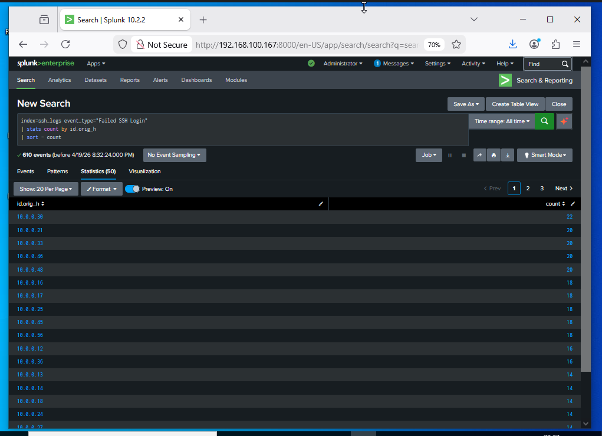
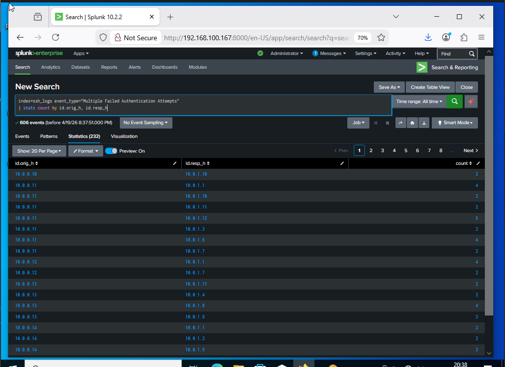
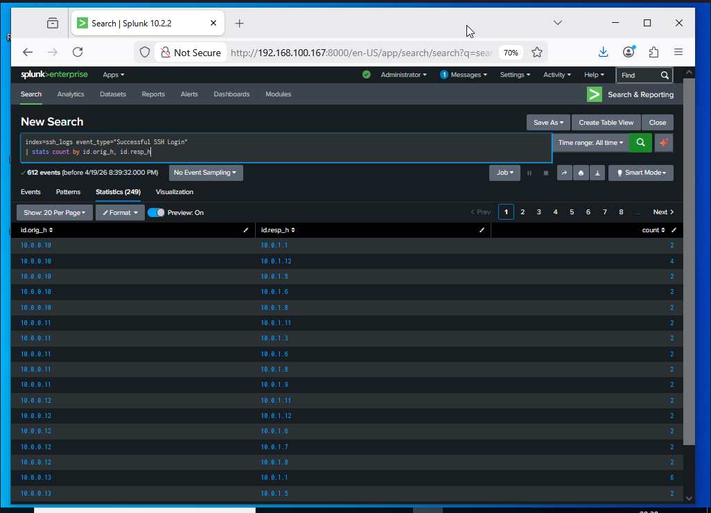
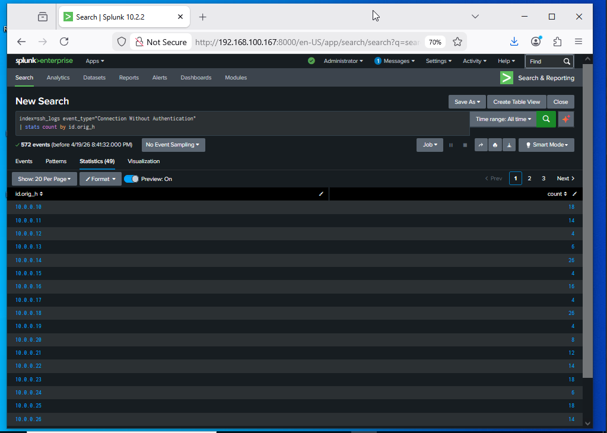
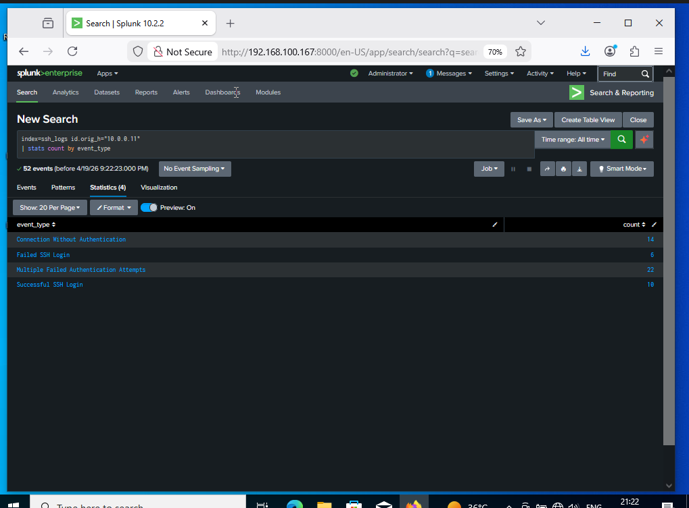
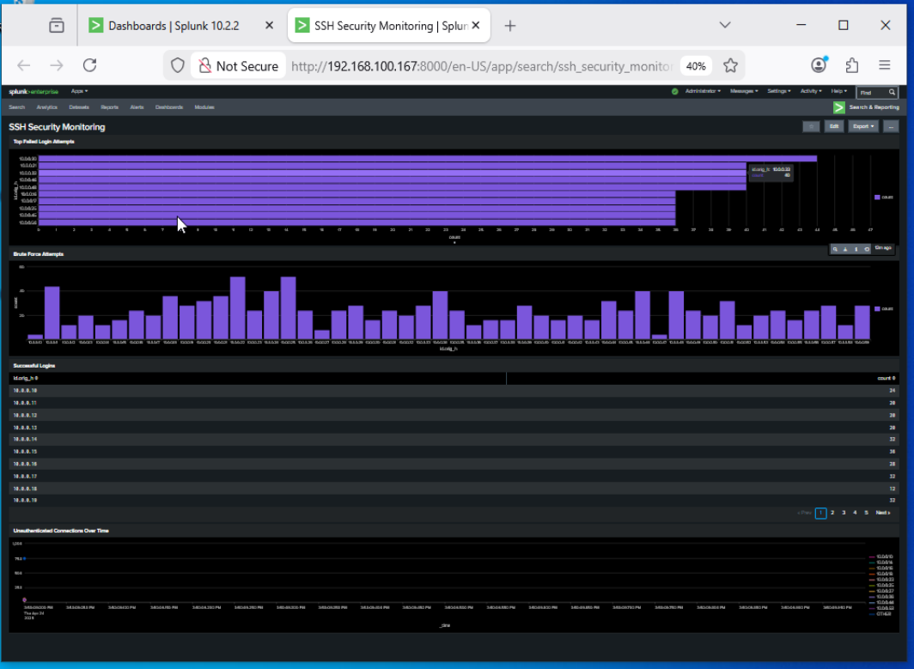

# 🔐 SSH Log Analysis using Splunk

## 📌 Overview

This project demonstrates how to detect and investigate SSH-based attacks using **Splunk**. It focuses on identifying brute-force attempts, unauthorized access, and suspicious connection behavior from log data.

The goal is to simulate real SOC analyst work: **detect → analyze → respond**.

---

## 🎯 Objectives

* Detect failed and successful SSH logins
* Identify brute-force attacks
* Monitor suspicious unauthenticated connections
* Create dashboards for monitoring
* Configure alerts for high-risk activity

---

## 🧰 Tech Stack

* SIEM Tool: Splunk Enterprise
* Data Format: JSON
* Logs: SSH Authentication Logs

---

## 📂 Project Structure

```
data/
queries/
docs/
screenshots/
README.md
```

---

## ⚙️ Setup

### 1. Upload Logs to Splunk

* Open Splunk → Search & Reporting
* Add Data → Upload
* Upload `ssh_log.json`
* Set:

  * sourcetype = `_json`
  * index = `ssh_logs`

---

### 2. Validate Data

```spl
index=ssh_logs | stats count by event_type
```

---

## 🔍 Detection Queries

### 🚨 Failed Login Detection

```spl
index=ssh_logs event_type="Failed SSH Login"
| stats count by id.orig_h
| sort - count
```



---

### 🔓 Brute Force Detection

```spl
index=ssh_logs event_type="Multiple Failed Authentication Attempts"
| stats count by id.orig_h, id.resp_h
```



---

### ✅ Successful Logins

```spl
index=ssh_logs event_type="Successful SSH Login"
| stats count by id.orig_h, id.resp_h
```



---

### ⚠️ Unauthenticated Connections

```spl
index=ssh_logs event_type="Connection Without Authentication"
| stats count by id.orig_h
```



---

## 🚨 Incident Analysis

### Case 1: Brute Force Attack

* High number of failed login attempts from a single IP
* Followed by a successful login
* Indicates possible credential compromise



### Case 2: SSH Scanning Activity

* Multiple connections without authentication
* Indicates reconnaissance or probing

---

## 📊 Dashboards

Dashboards created in Splunk:

* Failed logins by IP
* Successful logins
* Brute force detection
* Unauthenticated connection trends



---

## 🔔 Alerts

* Trigger when failed attempts > 5 within 10 minutes
* Detect high-risk login activity

---

## 🧠 Key Learnings

* Log ingestion and parsing in Splunk
* Writing SPL queries for detection
* Identifying attack patterns
* Monitoring logs using dashboards
* Creating alerts for security events

---

## ⚠️ Limitations

* Static dataset (not real-time logs)
* No threat intelligence integration
* No automated response

---

## 🚀 Future Improvements

* Integrate threat intelligence APIs
* Automate blocking of malicious IPs
* Use real Linux logs
* Add advanced correlation rules

---

## 🏁 Conclusion

This project demonstrates how a SOC analyst detects and investigates SSH-based attacks using log analysis and SIEM tools.

---

## 👤 Author

Ram Charan
Aspiring SOC Analyst
